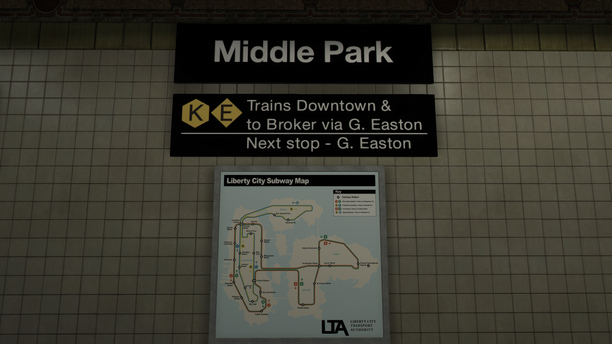

# LCPP Subway Overhaul
Originally a GTA IV mod, now ported over to GTA V for Liberty City Preservation Project users. A lore-friendly overhaul of Liberty City's subway system to faithfully resemble its real life counterpart.

The goal of the mod is to provide a more immersive subway experience without breaking the game lore.

**Created and released in celebration for the [120th anniversary](https://ny1.com/nyc/all-boroughs/traffic_and_transit/2024/10/26/new-york-city-subway-celebrates-120th-anniversary) of the subway system.**

### Contents
- Replaced all subway signs that now captures the iconic NYC style: black with Helvetica font.
- All subway map at stations were replaced with a more accurate one.
- Several stations were renamed to eliminate repetitive/duplicate names, majority are in Algonquin.

## Installation
> [Singleplayer]
> 
> put files into "mods\update\x64\dlcpacks\liberty_city\dlc.rpf\x64\levels\gta5\liberty_city\east\[Folder with corresponding name].rpf"
> 
> put files into "mods\update\x64\dlcpacks\liberty_city\dlc1.rpf\x64\levels\gta5\liberty_city\manhat\[Folder with corresponding name].rpf"
> 
> put files into "mods\update\x64\dlcpacks\lcpack\dlc.rpf\x64\levels\gta5\vehicles\vehicles\vehicles.rpf"

> [Singleplayer HD]
> 
> *Not yet available due to different file structure, for now use Ctrl and F3 and search .rpf with corresponding name, and replace the one in it.*

> [FiveM]
> 
> put "bronx_e" and "bronx_w" and "brook_n2" and "brook_n2" and "queens_e" and "queens_m" and "queens_w" and "queens_w2" folder into "[LCPP_v0.1]\libertycity\stream\dlc\east" then replace
> 
> put "manhat05" and "manhatsw" and "subwayxr" folder into "[LCPP_v0.1]\libertycity\stream\dlc\manhat" then replace
> 
> put "vehicles" folder into "[LCPP_v0.1]\lcpack\stream\levels\gta5\vehicles\vehicles" then replace

### Changenotes
#### [v2.0]
- Added subway train textures

#### [v1.0]
- Initial release

### Credits
- Meesmoth for the original mod for GTA IV
- ozzysunn for porting the mod to GTA V
- dexyfex for OpenMapTools
- World Travel team for Liberty City Preservation Project
